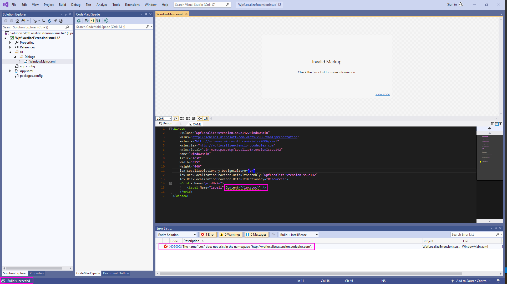

# What is this?

This repository has been created to show in action the issue [#142](https://github.com/XAMLMarkupExtensions/WPFLocalizationExtension/issues/142) of the WPFLocalizationExtension repository.

The code in this repository produces the following error after building the solution, at design time only:
>**Error XDG0008**
>
>The name "Loc" does not exist in the namespace "http://wpflocalizeextension.codeplex.com".

